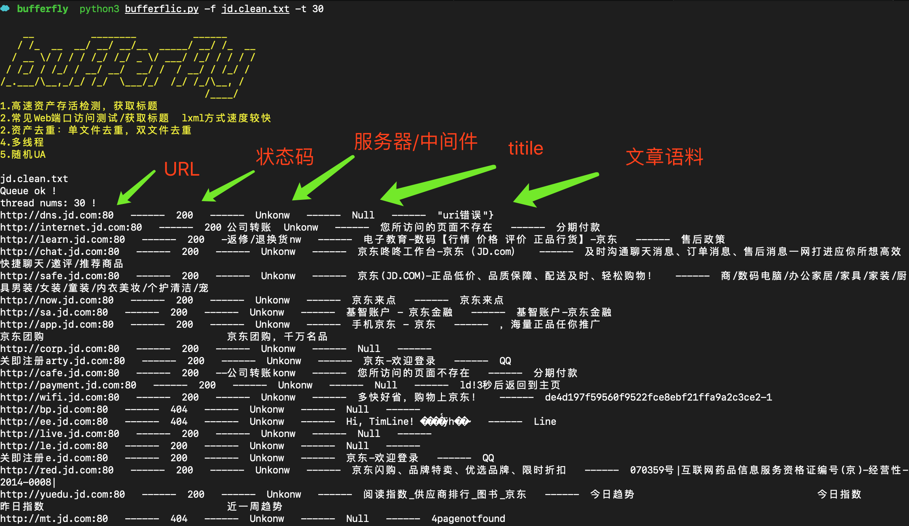

# bufferfly
攻防演习/渗透测试资产处理小工具，对攻防演习/渗透测试前的信息搜集到的大批量资产/域名进行存活检测、获取标题头、语料提取、常见web端口检测等。

```
   __          ________          ______     
   / /_  __  __/ __/ __/__  _____/ __/ /_  __
  / __ \/ / / / /_/ /_/ _ \/ ___/ /_/ / / / /
 / /_/ / /_/ / __/ __/  __/ /  / __/ / /_/ / 
/_.___/\__,_/_/ /_/  \___/_/  /_/ /_/\__, /  
                                    /____/   
1.高速资产存活检测，获取标题
2.常见Web端口访问测试/获取标题  lxml方式速度较快
2.资产去重：单文件去重，双文件去重
4.多线程
5.随机UA
```




# 使用
```
攻防演习/渗透测试资产处理小工具 
usage: bufferflic.py [-h] [-t] [-n] [--mvdups] [--mvdups2]

攻防演习/渗透测试资产处理框架，对攻防演习前搜集到的大量资产信息进行处理的小工具

optional arguments:
  -h, --help      show this help message and exit
  -t , --thread   线程参数
  -n , --name     要获取标题的文件
  --mvdups        单文本去重
  --mvdups2       去除file1中含有file2内容的部分，然后将两个文件合并

```

# DEFF

1. 使用lxml方式提取，速度更快
2. 添加

# requirements

1. requests
2. lxml
3. argparse

```shell
pip3 install -r requirements.txt
```

# TODO

1. 批量域名指纹/中间件识别如何快速检测？
2. 导出excel功能
3. 输出格式化
